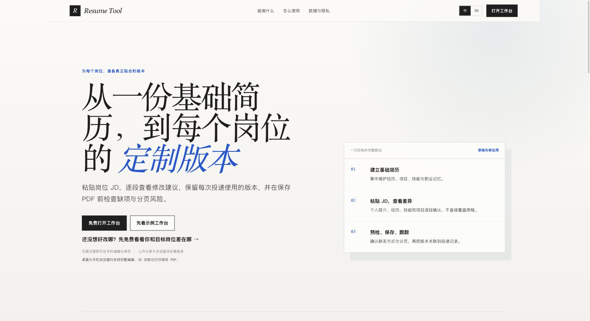

# 简历工作室 · Resume Studio

**从一份基础简历，到每个岗位的定制版本。**

粘贴岗位 JD，逐段查看修改建议，保留每次投递用的版本，并在保存 PDF 前检查缺项与分页风险。

🌐 **在线体验**：[jianlistudio.cn](https://jianlistudio.cn)



---

## 一次定制的完整路径

1. **建立基础简历** — 集中维护经历、项目、技能与职业记忆
2. **粘贴 JD，查看差异** — 个人简介、经历、技能和项目逐段确认，不直接覆盖原稿
3. **预检、保存、跟踪** — 确认联系方式与分页，再把版本关联到投递记录

## 功能亮点

- 📝 **基础简历中心** — 一处维护你的全部经历，投递时按需裁剪
- 🎯 **JD 定制** — 针对目标岗位逐段生成修改建议，保留多个投递版本
- 🔍 **导出预检** — 保存 PDF 前检查缺项、联系方式与分页风险
- 💾 **免注册可用** — 本机即可编辑与保存，公开分享或多设备同步再登录
- 📱 **多端支持** — 桌面与手机浏览器均支持完整编辑、JD 定制与打印保存 PDF

## 技术栈

Vue 3 · TypeScript · Vite · Tailwind CSS · Pinia · VueUse

> 本仓库是简历工作室的 C 端前端；完整产品还包含管理后台与后端 API 服务。

## 本地开发

```bash
npm install
npm run dev      # 启动开发服务器
npm run build    # 类型检查 + 生产构建
npm run preview  # 预览生产构建
```

推荐使用 Node.js 20.19+。开发工具推荐 [VS Code](https://code.visualstudio.com/) + [Vue (Official)](https://marketplace.visualstudio.com/items?itemName=Vue.volar) 插件。

---

<sub>Built by <a href="https://github.com/agnostic-ap">Aldrin (agnostic-ap)</a> · <a href="https://gt2kk.cn">gt2kk.cn</a></sub>
